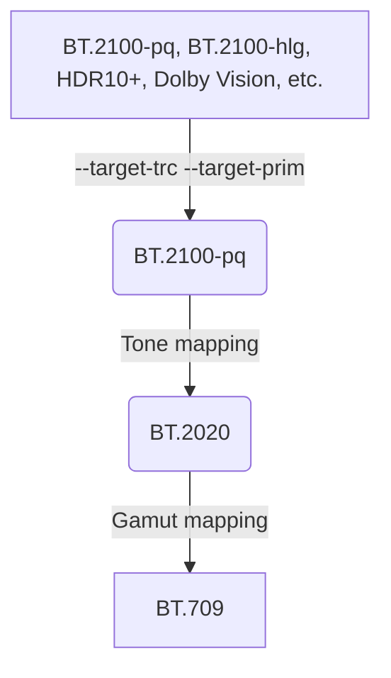

# HDR-toys

Put this auto-profile in your `mpv.conf`.  
Default combination matches ITU-R BT.2446 Conversion Method C.

```ini
[bt.2100]
profile-cond=get("video-params/sig-peak") > 1
profile-restore=copy
target-trc=pq
target-prim=bt.2020
glsl-shader=~~/shaders/hdr-toys/utils/clip_both.glsl
glsl-shader=~~/shaders/hdr-toys/transfer-function/pq_to_l.glsl
glsl-shader=~~/shaders/hdr-toys/transfer-function/l_to_linear.glsl
glsl-shader=~~/shaders/hdr-toys/utils/crosstalk.glsl
glsl-shader=~~/shaders/hdr-toys/utils/chroma_correction.glsl
glsl-shader=~~/shaders/hdr-toys/tone-mapping/bt2446c.glsl
glsl-shader=~~/shaders/hdr-toys/utils/crosstalk_inverse.glsl
glsl-shader=~~/shaders/hdr-toys/gamut-mapping/compress.glsl
glsl-shader=~~/shaders/hdr-toys/transfer-function/linear_to_bt1886.glsl
```

Also you can use it to get a better experience to play BT.2020 content.

```ini
[bt.2020]
profile-cond=get("video-params/primaries") == "bt.2020" and get("video-params/sig-peak") == 1
profile-restore=copy
target-prim=bt.2020
glsl-shader=~~/shaders/hdr-toys/transfer-function/bt1886_to_linear.glsl
glsl-shader=~~/shaders/hdr-toys/gamut-mapping/compress.glsl
glsl-shader=~~/shaders/hdr-toys/transfer-function/linear_to_bt1886.glsl
```

## What are these? What are they for?

The workflow



### Tone mapping

You can change the [tone mapping operator](https://github.com/Natural-Harmonia-Gropius/mpv_config/tree/main/portable_config/shaders/hdr-toys/tone-mapping) by replacing this line.  
For example, use reinhard instead of bt2446c.

```diff
- glsl-shader=~~/shaders/hdr-toys/tone-mapping/bt2446c.glsl
+ glsl-shader=~~/shaders/hdr-toys/tone-mapping/reinhard.glsl
```

This table lists the features of operators.[^1]

| Operator | Applied to  | Conversion peak       |
| -------- | ----------- | --------------------- |
| bt2390   | Ictcp       | metadata[^2]          |
| bt2446a  | YCbCr       | metadata              |
| bt2446c  | xyY         | 1000nit (adjustable)  |
| reinhard | YRGB        | metadata              |
| hable    | YRGB        | metadata              |
| hable2   | YRGB        | metadata              |
| suzuki   | YRGB        | 10000nit (adjustable) |
| uchimura | YRGB        | 1000nit               |
| hejl2015 | RGB         | metadata              |
| lottes   | maxRGB      | metadata              |
|          |             |                       |
| clip     | RGB         | SDR peak[^3]          |
| linear   | YRGB        | metadata              |
| heatmap  | Various[^4] | 10000nit              |

[^1]: Operators below the blank row are for testing purposes.
[^2]:
    Default to 1000nit.  
    You can also set it manually like this `set glsl-shader-opts L_hdr=1000`  
    [hdr-toys-helper.lua](https://github.com/Natural-Harmonia-Gropius/mpv_config/blob/main/portable_config/scripts/hdr-toys-helper.lua) can get it automatically from the video's metadata.

[^3]:
    Default to 203nit.  
    You can also set it manually like this `set glsl-shader-opts L_sdr=203`.  
    In some color grading workflows it is 100nit.

[^4]:
    You can use it for `set glsl-shader-opts heatmap/enabled=N`  
    N = 1:Y, 2:maxRGB, 3:meanRGB (arithmetic), 4:meanRGB (geometric), 5: Intensity

### Chroma correction

### Crosstalk

### Gamut mapping
